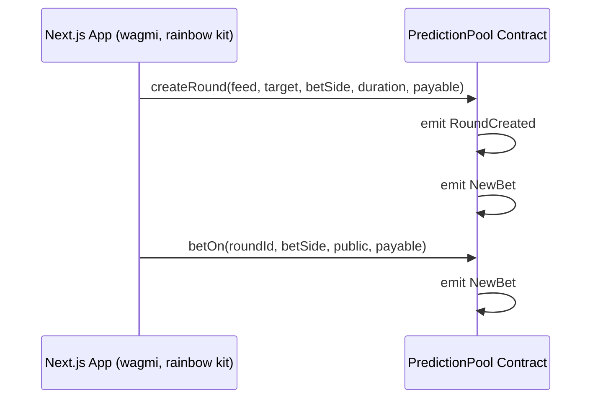
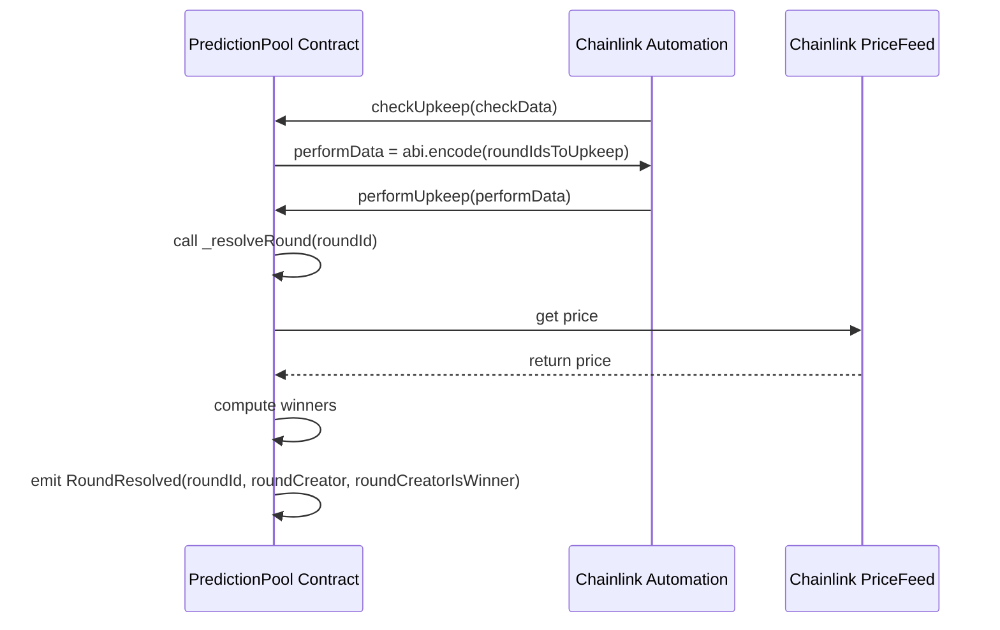
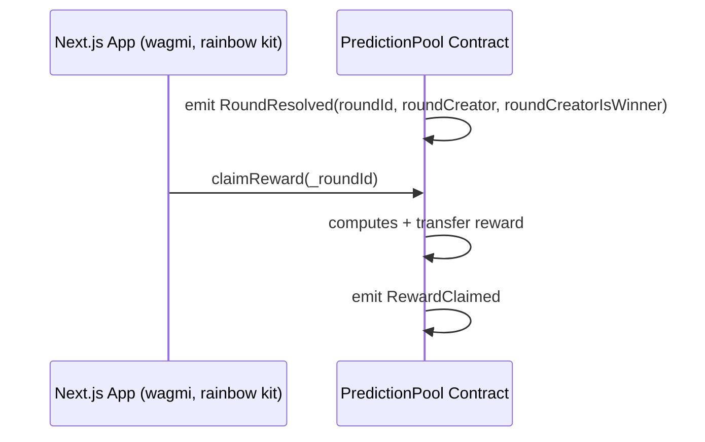
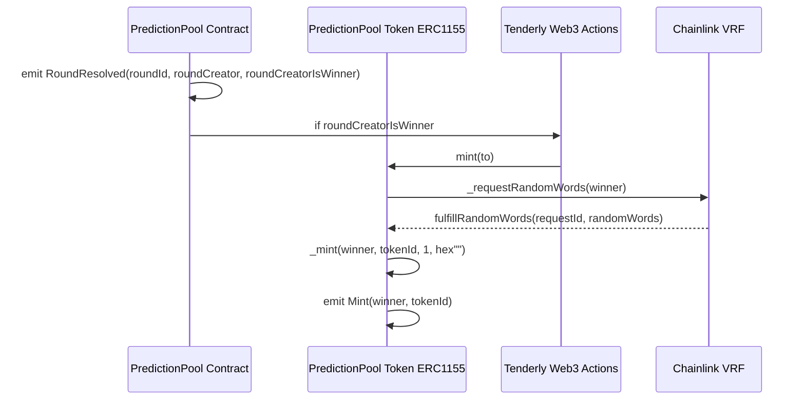

# 🎲 Bet2Gether

A **full-stack Web3 DApp** built with **Next.js**, **Foundry**, and **Solidity**, enabling users to participate in ETH-based prediction games on Ethereum. Real-time prices are powered by **Chainlink Price Feeds**, game resolution is automated via **Chainlink Keepers**, and winning creators earn **ERC-1155 NFTs**. Future iterations will integrate DAO governance for community-driven decision-making.

This DApp runs on the **Ethereum _Sepolia_ testnet**, leveraging smart contracts, **real-time event listeners**, and decentralized services to provide interactive, transparent gameplay.

> 💡 Need Sepolia ETH? You can get some from this faucet: [Sepolia Faucet](https://sepolia-faucet.pk910.de/)

## Core Features

- Create and participate in prediction games with ETH bets.
- Fetch real-time asset prices via [Chainlink Price Feeds](https://docs.chain.link/data-feeds/price-feeds) for game creation and resolution.
- Automatic game resolution via [Chainlink Keepers](https://docs.chain.link/chainlink-automation/overview/getting-started).
- Random NFT rewards for creators using [Chainlink VRF](https://docs.chain.link/vrf) and [Tenderly Web3 Actions](https://docs.tenderly.co/web3-actions/intro-to-web3-actions).
- Real-time updates using [Alchemy WebSockets](https://www.alchemy.com/docs/reference/subscription-api).
- NFT metadata stored on IPFS, ensuring decentralization and immutability.
- Opt-in on-chain event toasts for live feedback.

## Tech Stack

### Frontend stack

| Technology                   | Purpose                         |
| ---------------------------- | ------------------------------- |
| Next.js + TypeScript         | Core web framework              |
| Tailwind CSS + shadcn/ui     | UI styling and components       |
| Zod + React Hook Form        | Form validation and type safety |
| TanStack Table               | Interactive and sortable tables |
| TanStack Query (React Query) | Caching and data sync           |
| Wagmi + RainbowKit           | Web3 wallet connection & hooks  |
| pnpm                         | Frontend package manager        |

### Backend stack

| Layer             | Technologies                       |
| ----------------- | ---------------------------------- |
| Smart Contracts   | Solidity, Foundry, Sepolia testnet |
| Automation        | Chainlink Keepers (logic based)    |
| Asset prices      | Chainlink Price Feeds              |
| Randomness        | Chainlink VRF v2.5                 |
| Storage           | IPFS                               |
| Blockchain Access | Alchemy HTTP + WebSocket           |
| Off-chain Logic   | Tenderly Web3 Actions              |
| Package Manager   | forge                              |

## 🧩 Architecture Overview

Bet2Gether uses an on-chain, event driven system to sync UI state with blockchain data in real-time.

- Contract events are streamed via Alchemy WebSockets and processed with wagmi `watchContractEvent`.

- Users can switch on-chain event toasts (`GameListenerToastsSwitch`)

- Custom hooks (`usePPoolNewBetEvent`, `usePPoolNewStatusEvent`) selectively refetch only affected queries.

- Independent React Context Providers manage data isolation:
  - `RoundsProvider` & `ActiveRoundsWithPlayerBetsProvider` → `BetOnGamesTab`
  - `RoundsProvider` & `ResolvedRoundsWithPlayerBetsAndWinsProvider` → `ClaimRewardsTab`
  Providers are independent at the React context level but share the same React Query client, ensuring global cache consistency.

Together, this ensures minimal re-rendering and maximum responsiveness for on-chain updates.

## Backend

### Smart Contracts

### 1. PredictionPool

Handles all ETH-based prediction games, allowing users to bet on whether an asset’s price (via Chainlink Price Feed) will rise or fall by each game’s end.

Core logic includes:

- Game (“round”) creation: users define the asset, target price, their prediction — whether the final price will be Less Than (LT) or Greater Than or Equal (GTE) to the target — as well as the bet amount and round duration.
- Bet placement: others join the game choosing “Less Than” (LT) or “Greater Than or Equal” (GTE)
- Automatic resolution: handled by Chainlink Keepers at the end of the round
- Secure payouts: winners claim rewards proportionally to bet amount and timing
- Asset prices fetched from Chainlink price feeds
- Owner controls: enable/disable feeds and set min duration
- Security: reentrancy protection, strict validation, gas-optimized custom errors

**PredictionPool Contract on Sepolia**  
[View on Etherscan](https://sepolia.etherscan.io/address/0x1a3d6f547ce55463b03151cbc17f323501fc9170#code)

#### Chainlink Price Feeds

The DApp uses Chainlink Price Feed oracles to fetch reliable, decentralized price data for prediction rounds.

- **Purpose:**  
  - Fetch the current asset price when a user creates a game.  
  - Fetch the price at the time a game is "resolved" to calculate winners.  

- **Supported Trading Pairs:**  
  - LINK / USD  
  - ETH / USD  
  - BTC / USD  
  - DAI / USD  

- **Integration:**  
  Each `PredictionPool` round is linked to a specific Chainlink price feed. The oracle ensures fairness by providing tamper-resistant, real-time price data.

#### Chainlink Keepers

The DApp uses Chainlink Keepers to automatically trigger game resolution once the duration expires, ensuring trustless and continuous operation.

### 2. PredictionPoolToken (ERC-1155 NFT)

Manages NFT rewards for game creators who win their own rounds.

Key mechanics:

- ERC-1155 multi-token standard to allow users to own multiple copies
- Randomized NFT assignment via Chainlink VRF
- Mint trigger: off-chain Tenderly Web3 Action, listening for `PredictionPool_RoundResolved` events
- NFT metadata + assets: stored on IPFS

**PredictionPoolToken Contract on Sepolia**  
[View on Etherscan](https://sepolia.etherscan.io/address/0x0670019fcd39520acb9c907febd944bfeb567b35#code)

#### Chainlink VRF

The DApp uses Chainlink VRF v2.5 to provide randomness for ERC-1155 mints.

#### ⚙️ Tenderly Web3 Actions

Tenderly Web3 Actions extend on-chain logic off-chain — listening to events and performing follow-up operations.

In Bet2Gether, they:

- Watch for PredictionPool_RoundResolved events
- Parse logs to detect whether the round creator won
- Automatically mint a new ERC-1155 NFT for the winner
- Execute the mint via the PredictionPoolToken contract

Workflow Overview

- Event emitted by `PredictionPool` → `PredictionPool_RoundResolved`(roundId, creator, isWinner)
- Tenderly Action parses event logs
- If isWinner == true, it sends a transaction to the `PredictionPoolToken` contract to mint a ERC-1155 NFT to the creator.
- Logs + transactions viewable in Tenderly Dashboard
  
Example Tenderly Action Log:


Note:
Tenderly Web3 Actions are used as an experiment to handle off-chain logic based on on-chain events.

Moving this logic fully on-chain (in the PredictionPool contract) in the future would enhance:

- Transparency: logic verifiable directly in the smart contract.
- Fairness & immutability: cannot be altered or disabled off-chain.

### 📘 PredictionPool & PredictionPoolToken Deployment Parameters

All deployment parameters (e.g., LINK Token, VRF Coordinator, Subscription ID, Key Hash, ...)
can be found in the Foundry project under:

```bash
be/script/Constants_PredictionPool.sol
be/script/Constants_PredictionPoolToken.sol
```

These files centralize constants for reproducible deployments and environment consistency.

## 🚀 Deployment & Setup

### Repo Structure

```bash
fe/             # Next.js frontend
be/             # Foundry project (smart contracts & deployment scripts)
web3-actions/   # Tenderly Web3 Actions
```

### **Frontend (`fe/`)**

#### .env variables (fe)

```bash
NEXT_PUBLIC_ETH_SEPOLIA_ALCHEMY_HTTP_URL=  # Alchemy Sepolia RPC URL
NEXT_PUBLIC_ETH_SEPOLIA_ALCHEMY_WS_URL=    # Alchemy Sepolia WebSocket endpoint
NEXT_PUBLIC_WALLETCONNECT_PROJECT_ID=      # WalletConnect Project ID
```

```bash
cd fe
pnpm install
pnpm run dev
```

### **Backend (`be/`)**

#### .env variables (be)

```bash
ALCHEMY_SEPOLIA_RPC_URL=  # Alchemy Sepolia RPC URL
ETHERSCAN_API_KEY=        # Etherscan API key for contract verification
PRIVATE_KEY="0x..."       # Your deployer wallet private key
MY_ADDRESS="0x..."        # Your wallet address for convenience
```

#### Deploy Smart Contracts (Foundry)

> ⚠️ Make sure Foundry is installed to run the forge scripts:  [Foundry Installation](https://getfoundry.sh/)
>

##### Simulate locally (Foundry EVM)

```bash
cd be
forge script script/PredictionPoolScript.s.sol
forge script script/PredictionPoolTokenScript.s.sol
```

##### Simulate on Sepolia (dry-run)

```bash
cd be
forge script script/PredictionPoolScript.s.sol --rpc-url $RPC_URL
forge script script/PredictionPoolTokenScript.s.sol --rpc-url $RPC_URL
```

##### Deploy to Sepolia

```bash
cd be
forge script script/PredictionPoolScript.s.sol --rpc-url $RPC_URL --broadcast
forge script script/PredictionPoolTokenScript.s.sol --rpc-url $RPC_URL --broadcast
```

##### ✅ Deploy to Sepolia & Verify on Etherscan

```bash
cd be
forge script script/PredictionPoolScript.s.sol --rpc-url $RPC_URL --broadcast --verify
forge script script/PredictionPoolTokenScript.s.sol --rpc-url $RPC_URL --broadcast --verify
```

> 💡 Etherscan API: [Verify with Foundry](https://docs.etherscan.io/contract-verification/verify-with-foundry
)

## 🧩 Architecture & Flow

1️⃣ **Round Creation & Betting**

- Users create games ("_rounds_") on a given pair, with a target price, their prediction — whether the final price will be Less Than (LT) or Greater Than or Equal (GTE) to the target — as well as the bet amount and round duration.
- When creating a game ("_round_"), after selecting a pair, the current price for this pair is fetched from **Chainlink Price Feeds** and displayed.
- Other users can place bets on an active game by choosing a side.



2️⃣ **Chainlink Automation & Game Resolution**

- **Chainlink Automation** periodically checks for  games ("_rounds_") ready to resolve.
- `_resolveRound` fetches the final price, computes winners, and emits a `RoundResolved` event.



3️⃣ **Reward Claiming**

- Users claim rewards using `claimReward()`.
- Rewards are proportional to the bet amount and time of bet.
- Early bets have a higher potential reward if the side is correct.



4️⃣ **Reward ERC1155 Minting for Round Creator**

- If the round creator wins, they receive a random (using **Chainlink VRF** in the `PredictionPoolToken` contract) ERC1155 NFT.
- Currently handled via **Tenderly Web3 Actions**.

⚠️ This could be implemented on-chain in `_resolveRound` for full transparency and immutability.



## 🪙 Rewards & Tokenomics

The DApp supports two types of rewards:

### Player Rewards

Players share the total round pot based on:

- Total ETH bet on the given game
- Bet timing (earlier = higher weight)

Rewards claimed via `claimReward(roundId)`

### Creator NFT Rewards

If a round creator wins their own prediction,
they receive a random ERC-1155 NFT reward.

Currently handled off-chain (Tenderly), but easily portable on-chain.

## Future Improvements

### DAO & Governance Expansion

A future iteration of Bet2Gether could introduce a **Bet2GetherDAO smart contract** to decentralize key decisions across the platform.

Game creators who earn PredictionPoolToken NFTs could use them as governance tokens, granting voting power within the DAO.

DAO members would collectively decide on key parameters such as:

- Platform fees for game creation or betting (currently unset).
- Which Chainlink Price Feeds are authorized for new rounds.
- The allocation and use of any protocol treasury or revenue.

This governance layer would evolve Bet2Gether from a prediction DApp into a community-owned prediction ecosystem, where active participation directly shapes the platform’s future.

### Long-Term Vision

Beyond governance, Bet2Gether aims to evolve into a fully community-driven ecosystem where:

- A DAO Treasury accumulates a portion of platform fees and funds new feature proposals.
- Staking mechanisms reward long-term participants and DAO contributors.
- Cross-chain integrations extend prediction rounds to multiple EVM networks.
- The NFT collection gains utility in governance, staking, or reputation scoring, reflecting players’ and creators’ historical performance.

## 👨‍💻 Author

Siegfried Bozza
Full-Stack Web Developer | Blockchain Enthusiast

🐙 [GitHub](https://github.com/SiegfriedBz)
