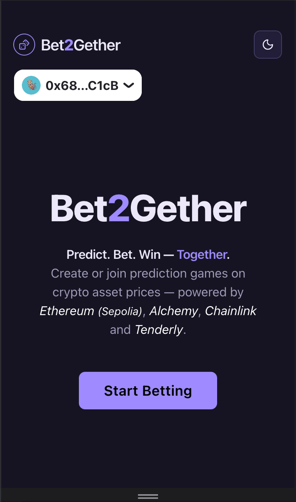
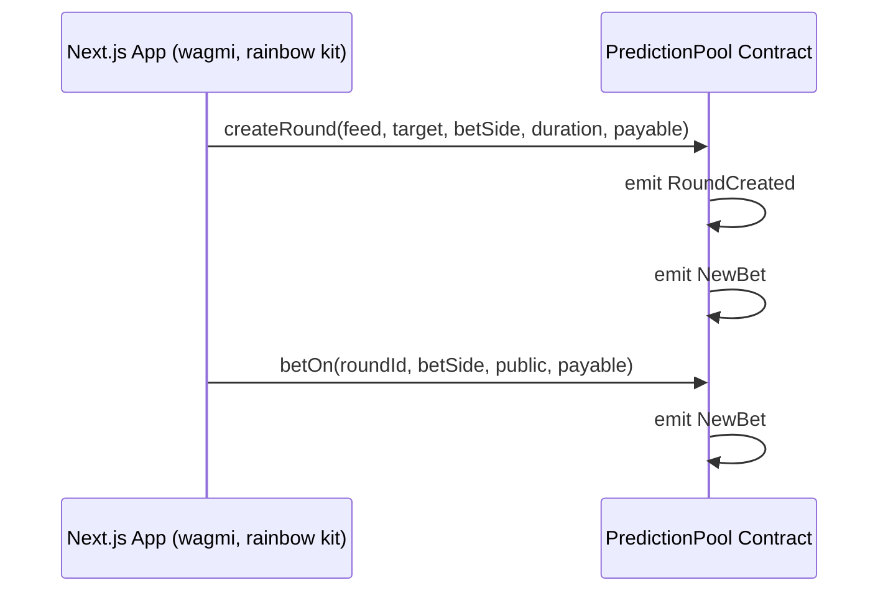
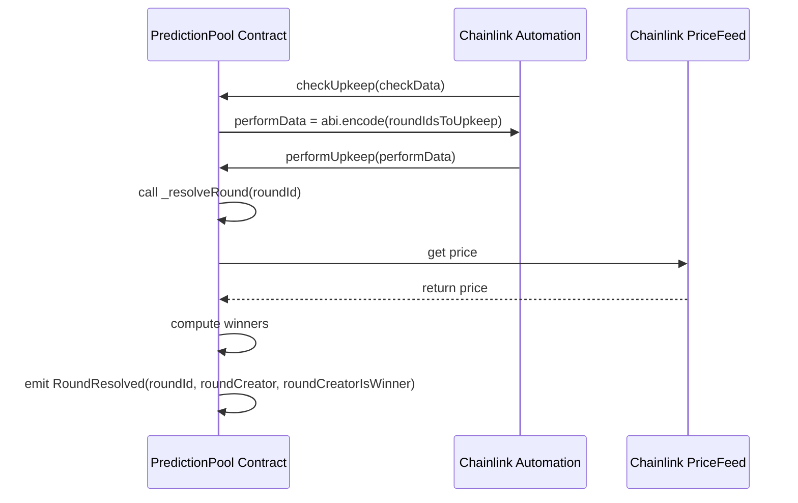
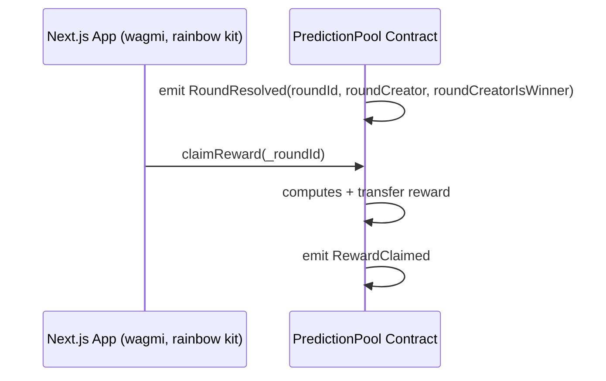
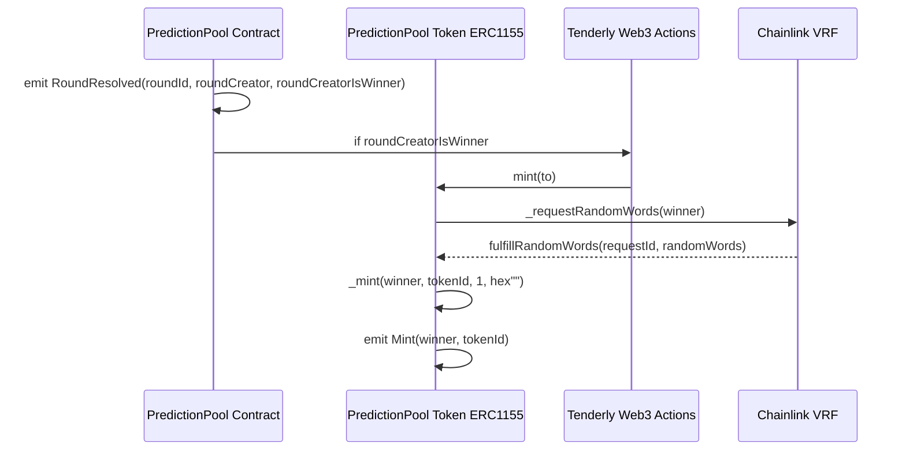
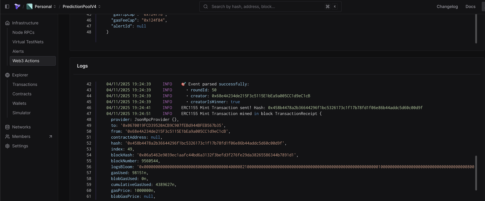

# 🎲 Bet2Gether

**Bet2Gether is a trustless prediction game where users bet on crypto price movements, with automated payouts and NFT rewards—powered by Ethereum, Solidity, Chainlink and Tenderly.**

## 🚀 Quick Start

1. **Try the Demo**: [🌐 Live Demo ✨](https://bet2gether-alpha.vercel.app/)
2. **Get Testnet ETH**: [Sepolia Faucet](https://sepolia-faucet.pk910.de/)
3. **Create a Game**: Pick an asset, predict its price, bet ETH, claim rewards and win NFTs!


*Game creation flow (1/2)*


*Game creation flow (2/2)*

## 🎮 How It Works

### For Players

1. **Create**: Pick an asset (LINK/ETH/BTC/DAI), predict price movement (↑/↓) against USD, set duration, and bet ETH.
2. **Bet**: Join active games by predicting outcomes and betting ETH.
3. **Win**: Claim ETH rewards if your bet was correct (weighted by bet size/timing).
4. **Earn NFTs**: Game creators who win also receive a **random ERC-1155 NFT**.

> **How It’s Trustless**:
>
> - **Prices**: **Chainlink Price Feeds** (tamper-proof, decentralized).
> - **Game Resolution**: **Chainlink Keepers** (automated, no admin).
> - **Rewards**: **Chainlink VRF** (provably fair randomness).

### For Developers

- **Tech Stack**: **Next.js** + **Solidity** + **Chainlink** + **Tenderly Web3 Actions**.
- **Why It’s Unique**:
  - Fully on-chain (*except* Tenderly Web3 Actions for NFT minting—*temporary off-chain logic experiments*).
  - **Automated**, **transparent**, and **no admin control** over game outcomes.

---

## ✨ Key Features

 | Feature | Details |
 |-----------------------|-------------------------------------------------------------------------|
 | **Prediction Games**  | Bet on ETH/BTC/LINK/DAI price movements (↑/↓) against USD                               |
 | **Fair Pricing**      | Powered by **Chainlink Price Feeds** ensure tamper-proof, decentralized asset prices     |
 | **Auto-Resolution**   | **Chainlink Keepers** trigger resolution at deadline—no admin intervention                  |
 | **NFT Rewards**       | Winning creators receive **randomized ERC-1155 NFTs** (via **Chainlink VRF**)    |
 | **Real-Time UI**      | **Alchemy WebSockets** for live updates (new games, bets, resolutions, NFT rewards)           |

---

## 🛠️ Tech Stack

### Frontend

| Technology                   | Purpose                         |
| ---------------------------- | ------------------------------- |
| Next.js + TypeScript         | Core framework              |
| Tailwind + shadcn/ui     | UI styling and components       |
| Zod + React Hook Form        | Form validation and type safety |
 | React Context         | State management (isolated providers for games/bets) |
 | Custom Hooks          | `usePPoolNewBetEvent`, `usePPoolNewStatusEvent` (on-chain event-driven refetching) |
| TanStack Query (React Query) | Caching and data sync           |
| TanStack Table               | Interactive and sortable tables |
| **Wagmi** + RainbowKit           | Web3 wallet connection & hooks  |
| pnpm                     | Frontend package manager       |

### Backend

| Layer          | Technologies                     |
 |----------------|----------------------------------|
 | Contracts  | **Solidity**, **Foundry**, ***Sepolia***      |
 | Testing    | **Foundry tests**          |
 | Oracles     | **Chainlink** Price Feeds / Keepers (Automation) / VRF (Randomness) |
 | Storage    | IPFS (NFT metadata)             |
 | Blockchain Access        | **Alchemy** (HTTP + WebSocket)       |
 | Off-Chain Logic  | **Tenderly Web3 Actions** (NFT minting)          |
 | Package Manager | forge |

---

## 📚 Technical Details

### Frontend details

- **React Context Providers**:
  - `RoundsProvider`: Manages active/resolved rounds.
  - `ActiveRoundsWithPlayerBetsProvider`: Tracks user bets in active games.
  - `ResolvedRoundsWithPlayerBetsAndWinsProvider`: Tracks resolved games and claimable rewards.
  - **Performance**: Independent providers minimize re-renders; shared React Query client ensures cache consistency.
- **Real-Time Updates**:
  - **Alchemy WebSockets** → wagmi `watchContractEvent` → selective query refetching.

### Backend details

- **Chainlink Workflow**:
  - **Price Feeds**: Fetch real-time prices for game creation (by user) / resolution (automated).
    - Supported Price Feeds:
      - `LINK/USD`, `ETH/USD`, `BTC/USD`, `DAI/USD`
      - A game on *Sepolia* uses the following [Chainlink Feeds](https://docs.chain.link/data-feeds/price-feeds/addresses?page=1&testnetPage=1&networkType=testnet&search=&testnetSearch=).
  - **Keepers**: Auto-resolve rounds at deadline.
  - **VRF**: Randomize NFT pick for winners (among 3 possible NFTs).
  - **ERC-1155**: Winners receive **unique NFTs** (randomized via Chainlink VRF) and can own multiple copies.
  
- **Tenderly Logic**:
  - Listens for `PredictionPool_RoundResolved` event → mints NFTs via `PredictionPoolToken` for game creator if is among winner(s).
  - **Future**: Migrate to on-chain for full transparency.

### Flow Diagrams

#### 1️⃣ Round Creation & Betting

- Users create games ("*rounds*") on a given pair, with a target price, their prediction — whether the final price will be Less Than (LT) or Greater Than or Equal (GTE) to the target — as well as the bet amount and round duration.
- When creating a game ("*round*"), after selecting a pair, the current price for this pair is fetched from **Chainlink Price Feeds** and displayed.
- Other users can place bets on an active game by choosing a side.



*Diagram: [Round Creation & Betting] Flow*

#### 2️⃣ Chainlink Automation & Game Resolution

- **Chainlink Automation** periodically checks for  games ("*rounds*") ready to resolve.
- `_resolveRound` fetches the final price, computes winners, and emits a `RoundResolved` event.



*Diagram: [Chainlink Automation & Game Resolution] Flow*

#### 3️⃣ Reward Claiming

- Users claim rewards using `claimReward()`.
- Rewards are proportional to the bet amount and time of bet.
- Early bets have a higher potential reward if the side is correct.



*Diagram: [Reward Claiming] Flow*

#### 4️⃣ Reward ERC1155 Minting for Round Creator

- If the round creator wins, they receive a random (using **Chainlink VRF** in the `PredictionPoolToken` contract) ERC1155 NFT.
- Currently handled via **Tenderly Web3 Actions**.

⚠️ This could be implemented on-chain in `_resolveRound` for full transparency and immutability.



*Diagram: [Reward ERC1155 Minting for Round Creator] Flow*

---

### 📘 Contracts

#### 1️⃣ PredictionPool

Handles core game logic, all ETH-based prediction games, allowing users to bet on whether an asset’s price (via Chainlink Price Feed) will rise or fall by each game’s end.

#### 2️⃣ PredictionPoolToken (ERC-1155 NFT)

Manages NFT rewards for game creators who win their own rounds.

| Contract               | Address (Sepolia)                                  | Purpose                          |
|------------------------|---------------------------------------------------|----------------------------------|
| PredictionPool         | [0x833d9fE4773690427A01F1C72896000C38aFE2AD](https://sepolia.etherscan.io/address/0x833d9fE4773690427A01F1C72896000C38aFE2AD) | Core game logic                 |
| PredictionPoolToken    | [0xf49beA8f5D5bf8e276CF4c4174E92ADc9f3C3eB6](https://sepolia.etherscan.io/address/0xf49beA8f5D5bf8e276CF4c4174E92ADc9f3C3eB6) | ERC-1155 NFT rewards            |

---

### 🚀 Setup & Deployment

#### Backend setup

All deployment parameters (e.g., LINK Token, VRF Coordinator, Subscription ID, Key Hash, ...) can be found in the Foundry project under:

```bash
be/script/Constants_PredictionPool.sol
be/script/Constants_PredictionPoolToken.sol
```

##### 1. (be) Environment Variables

```bash
# Backend
ALCHEMY_SEPOLIA_RPC_URL=
ETHERSCAN_API_KEY=
PRIVATE_KEY=
```

##### 2. Deploy (and get verified) contracts on *Sepolia* Testnet

```bash
# Backend
cd be 
# Deploy PredictionPool
forge script script/PredictionPoolScript.s.sol --rpc-url \$RPC_URL --broadcast --verify
# Deploy PredictionPoolToken
forge script script/PredictionPoolTokenScript.s.sol --rpc-url \$RPC_URL --broadcast --verify
```

#### Tenderly Setup

1. **Configure**
   - Update `web3-actions/` with deployed contract addresses/ABIs.
   - Set secret variables (Tenderly API key, RPC URL).

2. **Deploy**

   ```bash
   cd web3-actions && tenderly actions deploy
   ```

3. **Monitor**

View logs/transactions in the Tenderly Dashboard.

Example Tenderly Action Log:



> **Note**:
> Tenderly is **temporarily** used for NFT minting to:
>
> - Experiment with off-chain automation.
> - Reduce gas costs for users during testing.
> *Future*: All logic will migrate on-chain.

#### Frontend setup

##### 1. (fe) Environment Variables

```bash
# Frontend
NEXT_PUBLIC_ETH_SEPOLIA_ALCHEMY_HTTP_URL=
NEXT_PUBLIC_ETH_SEPOLIA_ALCHEMY_WS_URL=   # 🔧 For live updates
NEXT_PUBLIC_WALLETCONNECT_PROJECT_ID=
```

##### 2. Set deployed contracts addresses & ABIs

- Update `/fe/app/_contracts/` with the latest ABIs and addresses from Sepolia.

##### 3. Install dependencies & run locally

```bash
# Frontend
cd fe && pnpm install && pnpm dev
```

#### 📖 See Docs
>
>
> - [Chainlink Price Feeds](https://docs.chain.link/data-feeds/price-feeds)
> - [Chainlink Keepers](https://docs.chain.link/chainlink-automation)
> - [Chainlink VRF](https://docs.chain.link/vrf)
> - [Tenderly Web3 Actions](https://docs.tenderly.co/web3-actions)
> - [Alchemy WebSockets](<https://docs.alchemy.com/alchemy/guides/ethereum-websockets>)

### 🧪 Testing - Contracts

- **Current Coverage**:

  | Contract               | Lines (%) | Statements (%) | Branches (%) | Functions (%) |
  |------------------------|-----------|----------------|--------------|---------------|
  | `PredictionPool`       | 85.71     | 84.66          | 66.67        | 85.00         |
  | `PredictionPoolToken`   | 76.19     | 79.49          | 25.00        | 75.00         |
  | **Total**              | **74.42** | **74.36**      | **40.74**     | **72.00**      |

  - `PredictionPool.sol`: **85.71%** (138/161 lines) — Core logic + edge cases.
  - `PredictionPoolToken.sol`: **76.19%** (32/42 lines) — Minting + VRF tests.
  - *Branches*: **40.74%** (edge cases like zero-address checks).

- **Run locally**

  ```bash
  cd be && forge test
  ```

---

## 🪙 Rewards & Tokenomics

The DApp supports two types of rewards:

### 1️⃣ Player Rewards

Players share the total round pot based on:

- Total ETH bet on the given game
- Bet timing (earlier = higher weight)

Rewards claimed via `claimReward(roundId)`

### 2️⃣ Creator NFT Rewards

If a round creator wins their own prediction,
they receive a random ERC-1155 NFT reward.

Currently handled off-chain (Tenderly), but easily portable on-chain.

---

## 🔮 Future Improvements

### 1️⃣ Testing Enhancements

- **Focus Areas**:
  - Reentrancy attacks in `PredictionPool`.
  - Invalid NFT minting in `PredictionPoolToken`.
- **Goal**: Increase branch coverage to **>80%**.

### 2️⃣ On-Chain NFT Minting

- **Migration Plan**:
  - Replace Tenderly with `PredictionPool` contract logic.
  - **Benefits**:
    - Full transparency (verifiable on-chain).
    - No off-chain dependencies.

### 3️⃣ DAO Governance

- **Design**:
  - Use `PredictionPoolToken` NFTs as governance tokens.
  - **Voting Scope**:
    - Platform fees (e.g., 1% of round pots).
    - Supported Chainlink Price Feeds.
- **Tools**: OpenZeppelin Governor.

---

## 🤝 Contributing

Open to collaborations! Reach out for:

- Smart contract audits
- Frontend optimizations
- DAO governance ideas

---

## Author

Built solo by **Siegfried Bozza**: Full-stack development, smart contracts, and deployment.

💼 [LinkedIn](https://www.linkedin.com/in/siegfriedbozza/)
🐙 [GitHub](https://github.com/SiegfriedBz)
